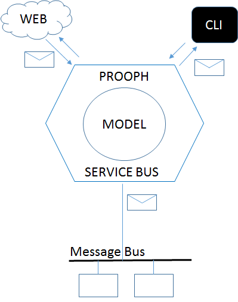

PSB - ProophServiceBus
======================

PHP 5.5+ Lightweight Service Bus Facade supporting CQRS and Micro Services

[](https://travis-ci.org/prooph/service-bus)
[](https://coveralls.io/github/prooph/service-bus?branch=master)
[](https://gitter.im/prooph/improoph)

Messaging API
-------------

prooph/service-bus is a lightweight messaging facade.
It allows you to define the API of your model with the help of messages.

1. Command messages describe the actions your model can handle.
2. Event messages describe things that happened while your model handled a command.
3. Query messages describe available information that can be fetched from your model.

prooph/service-bus shields your model. Data input and output ports become irrelevant and no longer influence the business logic.
I'm looking at you Hexagonal Architecture.

prooph/service-bus decouples your model from any framework. You can use a
web framework like Zend, Symfony, Laravel and co. to handle http requests and pass them via prooph/service-bus to your model
but you can also receive the same messages via CLI or from a message queue system like RabbitMQ or Beanstalkd.




Installation
------------

You can install prooph/service-bus via composer by adding `"prooph/service-bus": "~4.0"` as requirement to your composer.json.

Quick Start
-----------

```php
<?php

use Prooph\ServiceBus\CommandBus;
use Prooph\ServiceBus\Example\Command\EchoText;
use Prooph\ServiceBus\Plugin\Router\CommandRouter;

$commandBus = new CommandBus();

$router = new CommandRouter();

//Register a callback as CommandHandler for the EchoText command
$router->route('Prooph\ServiceBus\Example\Command\EchoText')
    ->to(function (EchoText $aCommand) {
        echo $aCommand->getText();
    });

//Expand command bus with the router plugin
$commandBus->utilize($router);

//We create a new Command
$echoText = new EchoText('It works');

//... and dispatch it
$commandBus->dispatch($echoText);

//Output should be: It works
```

Documentation
-------------

- [Overview](docs/service_bus_system.md)
- [Message Bus API](docs/message_bus.md)
- [Plugins](docs/plugins.md)
- [Async Message Producers](docs/async_message_producer.md)
- [Framework Integration](docs/factories.md)

Support
-------

- Ask questions on [prooph-users](https://groups.google.com/forum/?hl=de#!forum/prooph) google group.
- File issues at [https://github.com/prooph/service-bus/issues](https://github.com/prooph/service-bus/issues).
- Say hello in the [prooph gitter](https://gitter.im/prooph/improoph) chat.

Contribute
----------

Please feel free to fork and extend existing or add new features and send a pull request with your changes!
To establish a consistent code quality, please provide unit tests for all your changes and may adapt the documentation.

# Dependencies

Please refer to the project [composer.json](composer.json) for the list of dependencies.

License
-------

Released under the [New BSD License](LICENSE).